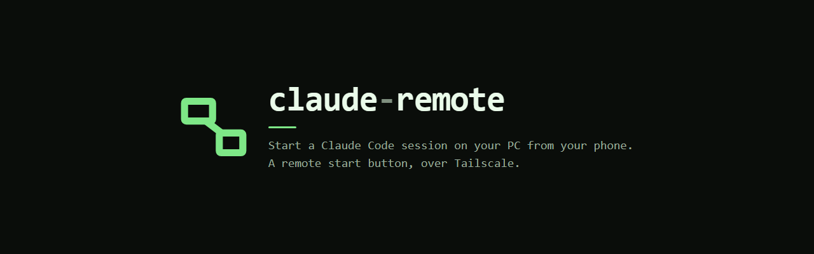
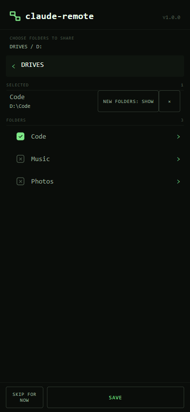
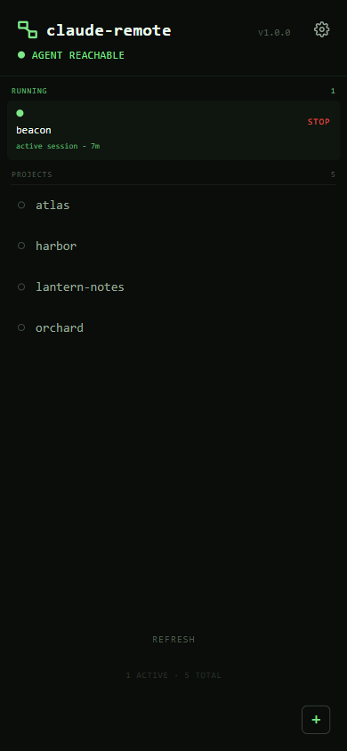
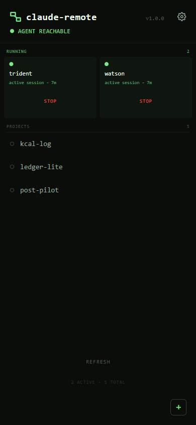

<p align="center">
  
</p>

# Claude Remote

Start, watch, and stop a Claude Code session on your Windows PC from your phone,
over Tailscale. Open the PWA, tap a project, and the session appears in the
Claude Code app - the same session whether you drive it from the phone or sit
down at the desk. Tap STOP and it ends the session.

It is a **remote start button, not a terminal.** There is no live console output
and no way to answer an interactive prompt from the phone; the actual
conversation happens in the Claude Code app. That is deliberate.

<table>
<tr>
<td width="33%"></td>
<td width="33%"></td>
<td width="33%"></td>
</tr>
<tr>
<td align="center"><sub>Choose folders to share</sub></td>
<td align="center"><sub>One session running</sub></td>
<td align="center"><sub>Two, side by side</sub></td>
</tr>
</table>

<sub>Project names in the screenshots are invented.</sub>

---

## Read this before you install it

This is a small personal tool published in case it is useful. It is not
hardened for a shared or hostile network, and what it does is genuinely
powerful, so here is the whole trade in plain terms.

**What you are turning on:** a service on your PC that launches Claude Code
**with the full permissions of your user account**, reachable by **every device
on your tailnet**, protected by **one six-digit passcode**.

That is a reasonable trade for a single-user tailnet you control. It is a bad
one if other people are on your tailnet, or if a device on it might be lost or
unlocked. The threat this defends against is an unlocked phone in someone
else's hand - not a hostile network peer.

Specifically:

- **No filesystem isolation.** A launched session can reach anything your user
  account can. Claude Code's sandbox does not run on native Windows and governs
  Bash only. This is an open design decision, not an oversight.
- **Only open projects you trust.** Tapping a project never runs a file from
  it, but the session it starts works inside it. With a venv active, a program
  the project ships in `venv\Scripts` (a `git.exe`, say) runs in place of the
  real one the first time Claude calls it by name.
- **The passcode is the only authentication.** It is stored hashed (scrypt,
  per-install salt), never logged or echoed, rate-limited with a lockout, and
  asked every time the app opens. It is still six digits.
- **Tailscale identity headers are not used as auth**, on purpose. The threat is
  a device already carrying your identity, so those headers would wave an
  attacker straight through.
- **There is a first-run window.** Until you set a passcode, the agent answers
  `403` on every route except the one that *sets* it - so whoever reaches it
  first sets it. Set your passcode at the desk **before** running
  `tailscale serve`. The setup order below exists for exactly this reason.
- **Check your drive's ACL.** On a drive that inherits
  `NT AUTHORITY\Authenticated Users:(I)(M)` (Modify), any authenticated account
  on the machine can rewrite the scripts that run as you at logon. That is not
  caused by this tool, but installing it is what makes it worth exploiting.
  Check with `icacls <drive-or-folder>`, and harden with:

  ```powershell
  icacls <folder> /inheritance:d
  icacls <folder> /remove:g "Authenticated Users"
  ```

If any of that is not a trade you want, don't install it. That is a completely
reasonable conclusion and no feature here changes it.

---

## Architecture

```
phone (PWA) --https(Tailscale)--> tailscale serve --http--> Local Agent
                                                              (Node,
                                                          127.0.0.1:8790)
                                                                 |
                                                                 v
                                                      agent/launch-session.ps1
                                                                 |
                                                                 v
                                                  claude.cmd --remote-control
                                                    (Claude Code app, Code tab)

STOP --> confirm on the tile --> taskkill on the session's process tree
         (nothing is written on your behalf: ask the session for a
         handoff first, while it still has its context)
```

`tailscale serve` terminates HTTPS on your machine's MagicDNS name and proxies
to the agent on loopback. The agent never binds to anything but `127.0.0.1` -
`tailscale serve` is the only path in, and it is a **proxy, not a filter**.

The agent has **zero runtime dependencies**. That is deliberate and worth
keeping.

## Requirements

Windows, Tailscale installed and logged in, Node >= 24.2.0, and the Claude Code
CLI on `PATH`.

## Install

In Claude Code, at the PC, run these **one at a time**. Paste them together and
Claude Code reads all three as one marketplace name. Wait for each to finish
before the next:

1. Add the marketplace:

   ```
   /plugin marketplace add MrTig-afk/claude-remote
   ```

2. Install the plugin:

   ```
   /plugin install claude-remote@claude-remote
   ```

3. Run setup (if Claude Code says the command is not found, restart it once so
   it loads the new plugin, then run it again):

   ```
   /claude-remote:setup
   ```

Setup walks you through the rest, in this order, and **the order matters**:

1. It checks Tailscale is up, and that Node and Claude Code are installed.
2. It copies the agent to `%LOCALAPPDATA%\claude-remote` and has it start at
   every logon. It listens on `http://127.0.0.1:8790` and nothing else.
3. It stops and hands you `http://127.0.0.1:8790`. Open it **at the desk**, set
   a six-digit passcode, then choose which folders the app may see. Nothing is
   shared until you pick it. Each folder is shared either as **one project**
   (a session starts in that folder) or as **a folder of projects** (each
   folder inside it is one). The app suggests one project when the folder holds
   a `.git` or a `CLAUDE.md`; you can change it then, or later in Settings.
4. **Only then** does it make the agent reachable from your tailnet, with
   `tailscale serve`. The app is at `https://<machine>.<tailnet>.ts.net:8790`.

Open that address on your phone, or any other device signed in to your
Tailscale. To keep it like an app: on an iPhone or iPad, open it in Safari, tap
Share, then **Add to Home Screen**; on Android, open it in Chrome, tap the
three-dot menu, then **Add to Home screen** (or **Install app**).

Good to know:

- No firewall rule is needed. Under serve the agent never leaves loopback, and
  loopback traffic does not traverse the firewall at all. Take it off the
  tailnet with `tailscale serve --https=8790 off`; see
  `docs/tailscale-https.md`.
- The agent starts at logon, not at boot: a PC sitting at the lock screen after
  a restart has **no agent running**, and the phone cannot reach it until you
  sign in. See `docs/agent-autostart.md` for why that trade was made. Once you
  are signed in, an agent that crashes is started again within a minute.
- When the app says the agent hit an error, restart it by running
  `/claude-remote:setup` in Claude Code on the PC. The agent runs with no
  window; what it printed is in
  `%USERPROFILE%\.claude\plugins\data\claude-remote-claude-remote\agent.log`.
- Port 8790 is the default, not a requirement: set a user environment variable
  `CLAUDE_REMOTE_AGENT_PORT` to move it, and tell setup, so the serve command
  uses the same number.

## Updates

Claude Code does not auto-update plugins from this marketplace unless you turn
it on: `/plugin` → **Marketplaces** → **claude-remote** → **Enable
auto-update**. To update by hand instead, run
`claude plugin update claude-remote@claude-remote`.

A plugin update does not reach the running agent by itself. When the plugin is
newer than the copy that runs, the next Claude Code session you start says
**"Claude Remote has an update. Run /claude-remote:setup to install it on this
PC."** Run it: setup installs the new version, restarts the agent and checks
it came up. If it did not, setup puts the previous version back, so the phone
keeps working. Your passcode, settings and open sessions are kept.

## What launching a session does to your environment

Worth knowing, because it is invisible from the phone. When you tap a project,
the launcher changes into that directory and activates an environment before
starting Claude Code. Nothing to configure; by default it checks two things,
in this order:

1. **A `venv` or `.venv` folder containing `Scripts\python.exe`.** The launcher
   puts that folder first on `PATH` itself. It never runs the project's
   `Activate.ps1`, because that file comes with the repo, and running it would
   let any cloned project execute code on your PC the moment you tap it.
2. **An `environment.yml` with a `name:`.** The launcher finds conda under
   `miniconda3` or `anaconda3` in your user folder, `AppData\Local` or
   `C:\ProgramData`, and activates that environment. If conda is not there, or
   the file has no name, the launch is refused with the reason, rather than
   starting a session in the wrong environment.

If neither is found, the session starts with no environment step.

**If you use poetry, uv, pipenv, a differently-named folder, conda installed
somewhere else, or a non-Python stack, it will find nothing** and your session
starts in the wrong environment with no visible sign of it. Set
`pre_launch_command` in the config file
(`%USERPROFILE%\.claude\plugins\data\claude-remote-claude-remote\config.json`):

```json
{ "pre_launch_command": "& \"$env:USERPROFILE\\miniconda3\\shell\\condabin\\conda-hook.ps1\"; conda activate myenv" }
```

Three constraints, and none of them is obvious. Read them before you set it.
And one rule: **never put a credential in this command.** If it fails, its
error text - which can quote the command - is written beside the pid file and
sent to the phone in the agent's response, so a token typed here leaves the
machine.

**It runs with `-NoProfile`, so your PowerShell profile does not exist.**
Anything `conda init`, `nvm` or similar installed into your profile - including
a bare `conda activate` - is simply undefined here. That is why the example
above dot-sources the conda hook first. A bare `conda activate myenv` falls
through to `conda.exe`, fails with "Run 'conda init' before 'conda activate'",
and you get a session in the base environment with no sign of it.

**The command must RETURN.** It runs inside the launcher, before Claude Code
starts, and there is no timeout - so anything that blocks hangs the launch and
no session ever appears. `poetry shell` is the trap here: it opens a nested
interactive shell and waits for it to exit, which never happens. Use
`Invoke-Expression (poetry env activate)` instead - note the wrapper, because
`poetry env activate` only PRINTS the activation line, it does not run it.

**Whichever command applies, it replaces the auto-detect for that project** -
`venv`/`.venv` is not tried as well. `pre_launch_command` is the fallback for
every project; set `pre_launch_commands` to override it for one:

```json
{
  "pre_launch_command": "& \"$env:USERPROFILE\\miniconda3\\shell\\condabin\\conda-hook.ps1\"; conda activate default",
  "pre_launch_commands": {
    "F:\\Dev\\Projects\\email-lint": "Invoke-Expression (poetry env activate)"
  }
}
```

Projects with no entry fall back to the single `pre_launch_command`, and
projects with neither keep the `venv`/`.venv` auto-detect. Keys need a **drive
letter** (`F:\...`): a `~` is never expanded, and anything else - including
`/Dev/Projects/web` - resolves against whatever directory the agent was started
in, so it usually matches nothing and whether it matches at all depends on how
the agent was launched. The agent warns about such a key, but only in its own
terminal. Matching is case-insensitive and a trailing slash does not matter.

To say **"this project needs nothing"** and keep the plain auto-detect even
though a global is set, map it to `null`:

```json
{ "pre_launch_commands": { "F:\\Dev\\Projects\\web": null } }
```

When it fails, the launch is refused and nothing starts: the project row on the
phone reads `launch unconfirmed`, and the reason is written to `<pid file>.err`
in `%USERPROFILE%\.claude\plugins\data\claude-remote-claude-remote\session-pids\`.
Read that file for the why - the app shows that it failed, not what the
command said.

This setting is deliberately not in the app. The value is executed, so a text
box reachable from your phone would turn the six-digit passcode into a way to
run anything on your PC - the exact threat described at the top of this file.
Editing the config file requires access to the machine, and anyone with that
can already run anything as you.

### Claude Code's "do you trust this folder?" question

Claude Code asks that the first time it opens a folder, and it needs someone at
the keyboard to answer. From the phone nobody is, so a session would sit on
that question and never reach your Code tab. **So when a session starts in a
folder you shared, the agent answers it for you**: it sets
`hasTrustDialogAccepted` for that folder in Claude Code's own `.claude.json` -
the same field the real dialog writes - in your home folder, or in the profile
folder set by `claude_config_dir` below. It adds that one field and keeps every
other value in the file as it was (the file is written back whole, so its
formatting is normalised), only ever for a shared folder you are launching, and
never creates the file. If it cannot, `agent.log` says so and the session may
stop on the question at the PC. The first-run screen says this too.

Trusting a folder is what lets Claude Code run that project's own
`.claude/settings.json` hooks and `.mcp.json` servers without asking. That is
why the rule at the top of this file is "only open projects you trust": sharing
a folder with this app now counts as saying so.

### More than one Claude Code profile

Sessions started from the phone use Claude Code's default profile
(`%USERPROFILE%\.claude`) and its login. If you run Claude Code with a second
profile - an alias that sets `CLAUDE_CONFIG_DIR`, say - and your login lives
there, a phone session would open **logged out** in the default one. Point the
app at the right profile in the config file:

```json
{ "claude_config_dir": "C:\\Users\\<you>\\.claude-max" }
```

It must be an absolute path to a folder that exists; anything else is ignored
with a warning in `agent.log`, so a typo never opens a session in a new, empty
profile. It is read on every launch, so no restart is needed.

## The opening report

A session you start from the phone opens by telling you where the work stands,
rather than sitting silent until you type something. The launcher does this by
submitting one prompt for you, "Read HANDOFF.md and give the opening report.",
and only when the project actually contains a `HANDOFF.md`. A project without
one starts silent, exactly as before.

It exists because the PWA is a start button: nobody is at the keyboard to type
the first message, so a session that opens silently has wasted the launch.

Turn it off with `"opening_report": false` in the config file. Only a literal
`false` counts - anything else leaves it on, deliberately, because a silent
session started from a phone gives you nothing to diagnose.

## Daily use

1. Open the PWA on your phone and enter the passcode.
2. Tap a project. It moves into the RUNNING tiles as the session launches and
   appears in the Claude Code app's Code tab - work there as normal.
3. A session you started at the desk shows up too, marked "desktop". You can end
   it from the phone the same way.
4. When finished, tap STOP. The confirm warns that nothing writes a handoff for
   you and offers OPEN CLAUDE FIRST, so you can ask the session for one while it
   still has its context. END ANYWAY ends the process tree; that is all it does.

## FAQ

**The app says "Waiting for the PC" or "Can’t reach your PC.", but Tailscale
says Connected.**
Fully quit the Tailscale app on the phone (swipe it away in the app switcher),
reopen it, then reopen claude-remote. The phone's Tailscale can show Connected
while its traffic has stopped moving; on iPhone its app may show a warning that
"magicsock" is not running. Restarting Tailscale restarts it.

**Doesn't Claude Code already have Remote Control?**
It does, and this is built on it: every session it starts runs with
`--remote-control`. What Remote Control needs is a session already running,
which means someone started it at the desk. This starts one with nobody there,
in the folder you pick from the phone.

**Couldn't one idle Remote Control session start the others?**
Close, and it would work. This keeps a plain button instead: no session sitting
idle to take the request, and nothing to talk to before a project opens.

**How is this different from Dispatch?**
Both run Claude on your own machine. The difference is the start: here there is
no desk step, and you choose the project folder before the session exists.

**Why not SSH into the PC from the phone?**
That was the first design. A terminal on a phone screen is the wrong tool for
driving Claude, and the Claude app already does that part well. This only has
to start the session.

**Why not a Discord or Telegram bot?**
Those are valid, and more general. This is narrower on purpose: one button, no
chat service in the middle, nothing leaving your tailnet.

**A session is waiting for me to approve something. Can I answer from the phone?**
Not from this app: it has no terminal. Answer it in the Claude app, where you
drive the session. To be asked less while you are away, set the project's
permissions before you leave.

**Is your own Claude setup included?**
No. My rules and notes are personal and stay private. The plugin is
self-contained and does not need them.

## Known limitations

- Windows only.
- The PC has to be on, logged in (the agent starts at logon) and on Tailscale.
- One six-digit passcode is the only authentication (see the threat model above).
- No live terminal output, and no way to answer an interactive prompt from the
  phone. A session that stalls on a prompt shows as stalled, not as why.
- Nothing reaps sessions or their MCP children automatically. On a memory-tight
  machine this bites at around 3-5 concurrent projects.
- The launcher is a convenience, not a boundary (see the threat model above).
- **Built for a personal machine, not a managed corporate one.** Setup
  registers a Scheduled Task, compiles a small launcher from source, and opens
  interactive windows as you. On a monitored work device that is a
  conversation with your IT team, not a download.

## Contributing

Contributions are welcome. For anything bigger than a small fix, open an issue
first and wait for a reply before you start - see `CONTRIBUTING.md`. Found a
security hole? Report it privately, as `SECURITY.md` describes - not in an issue.

`CONTRIBUTING.md` is the short version of what a change needs. `AGENTS.md` is
the same rules written for an AI coding agent working in this repo: commands,
hard rules, and where things are.

## Reading the source

Comments cite internal task ids like `T94` or `M9`. Those refer to this
project's own task history and are not needed to follow the code - they are kept
because each one records *why* a line is the way it is, and several mark bugs
that were expensive to find.

## Tests

```
node --test "agent/test/**/*.test.js"
```

Run from the repo root; the bare-directory form (`node --test agent/test/`)
fails on Windows.

Part of the suite drives a real headless Chrome to check no text input renders
under 16px, because below that iOS Safari zooms the page on focus and does not
zoom back out. If Chrome is not where the check looks, set `CHROME=<path>`, or
`ALLOW_NO_CHROME=1` to skip it knowingly - it fails rather than skips by default,
because a skipped guard is a green run.

## License

MIT. See `LICENSE`.
