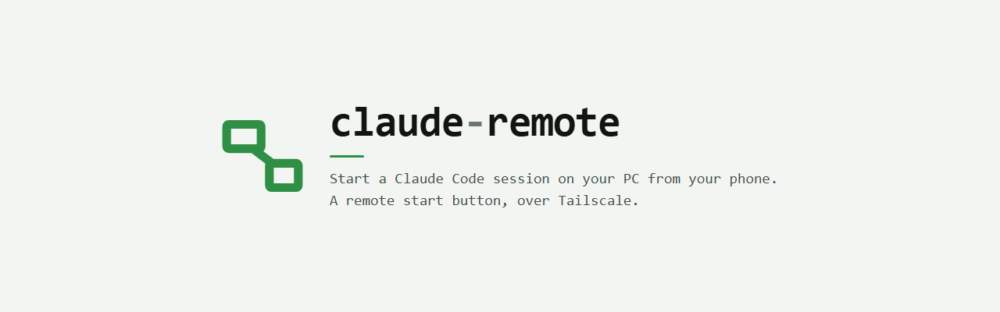

<p align="center">
  <picture>
    <source media="(prefers-color-scheme: dark)" srcset="docs/hero-dark.png">
    
  </picture>
</p>

# Claude Remote

Start, watch, and stop a Claude Code session on your Windows PC from your phone,
over Tailscale. Open the PWA, tap a project, and the session appears in the
Claude Code app - the same session whether you drive it from the phone or sit
down at the desk. Tap STOP and it ends the session and writes a handoff summary
for next time.

It is a **remote start button, not a terminal.** There is no live console output
and no way to answer an interactive prompt from the phone; the actual
conversation happens in the Claude Code app. That is deliberate.

<table>
<tr>
<td width="50%"></td>
<td width="50%"></td>
</tr>
<tr>
<td align="center"><sub>One session running</sub></td>
<td align="center"><sub>Two, side by side</sub></td>
</tr>
</table>

<sub>Project names in the screenshots are invented.</sub>

---

## Read this before you install it

This is a small personal tool published in case it is useful. It is not
hardened for a shared or hostile network, and what it does is genuinely
powerful, so here is the whole trade in plain terms.

**What you are turning on:** a service on your PC that launches Claude Code
**with the full permissions of your user account**, reachable by **every device
on your tailnet**, protected by **one six-digit passcode**.

That is a reasonable trade for a single-user tailnet you control. It is a bad
one if other people are on your tailnet, or if a device on it might be lost or
unlocked. The threat this defends against is an unlocked phone in someone
else's hand - not a hostile network peer.

Specifically:

- **No filesystem isolation.** A launched session can reach anything your user
  account can. Claude Code's sandbox does not run on native Windows and governs
  Bash only. This is an open design decision, not an oversight.
- **The passcode is the only authentication.** It is stored hashed (scrypt,
  per-install salt), never logged or echoed, rate-limited with a lockout, and
  asked every time the app opens. It is still six digits.
- **Tailscale identity headers are not used as auth**, on purpose. The threat is
  a device already carrying your identity, so those headers would wave an
  attacker straight through.
- **There is a first-run window.** Until you set a passcode, the agent answers
  `403` on every route except the one that *sets* it - so whoever reaches it
  first sets it. Set your passcode at the desk **before** running
  `tailscale serve`. The setup order below exists for exactly this reason.
- **Check your drive's ACL.** On a drive that inherits
  `NT AUTHORITY\Authenticated Users:(I)(M)` (Modify), any authenticated account
  on the machine can rewrite the scripts that run as you at logon. That is not
  caused by this tool, but installing it is what makes it worth exploiting.
  Check with `icacls <drive-or-folder>`, and harden with:

  ```powershell
  icacls <folder> /inheritance:d
  icacls <folder> /remove:g "Authenticated Users"
  ```

If any of that is not a trade you want, don't install it. That is a completely
reasonable conclusion and no feature here changes it.

---

## Architecture

```
phone (PWA) --https(Tailscale)--> tailscale serve --http--> Local Agent
                                                              (Node,
                                                          127.0.0.1:8790)
                                                                 |
                                                                 v
                                                      agent/launch-session.ps1
                                                                 |
                                                                 v
                                                  claude.cmd --remote-control
                                                    (Claude Code app, Code tab)

STOP --> taskkill on the session's process --> agent/handoff-session.ps1
         (hidden `claude -p ... /handoff`, writes the handoff, no
         --remote-control so it never registers a session of its own)
```

`tailscale serve` terminates HTTPS on your machine's MagicDNS name and proxies
to the agent on loopback. The agent never binds to anything but `127.0.0.1` -
`tailscale serve` is the only path in, and it is a **proxy, not a filter**.

The agent has **zero runtime dependencies**. That is deliberate and worth
keeping.

## Requirements

Windows, Tailscale installed and logged in, Node >= 24.2.0, and the Claude Code
CLI on `PATH`.

## Setup

**The order matters.** Step 4 is where you set the passcode; step 5 is where the
agent becomes reachable. Never do 5 before 4.

1. **Check Tailscale is up.** `tailscale status`. If it is not, fix that first -
   the alternatives (a port forward, an unscoped firewall rule) are worse than
   not running this at all.

2. **Start the agent.**

   ```powershell
   node agent/server.js
   ```

   It listens on `http://127.0.0.1:8790` and nothing else. Port 8790 is the
   default, not a requirement: set `CLAUDE_REMOTE_AGENT_PORT` to move it, and
   use the same number in both positions of the serve command in step 5.

3. **Optional - have it start itself at logon.** Register the scheduled task;
   see `docs/agent-autostart.md`. Note the limitation there: an at-logon trigger
   means a cold boot sitting at the lock screen has **no agent running**, and
   the phone gets a connection error with no explanation. Running it at boot as
   SYSTEM would fix that and break the profile it needs, so this is a real
   trade, not a bug.

4. **Open `http://127.0.0.1:8790` at the desk.** Set a six-digit passcode, then
   choose which folders the app may see. Nothing is shared until you pick it.

5. **Only now, expose it:**

   ```powershell
   tailscale serve --bg --https=8790 8790
   ```

   `--bg` survives a reboot and the certificate renews itself. The app is then
   at `https://<machine>.<tailnet>.ts.net:8790` - a real certificate, which is
   what makes it installable on the phone. Take it down with
   `tailscale serve --https=8790 off`. See `docs/tailscale-https.md`.

No firewall rule is needed. Under serve the agent never leaves loopback, and
loopback traffic does not traverse the firewall at all.

## What launching a session does to your environment

Worth knowing, because it is invisible from the phone. When you tap a project,
the launcher changes into that directory and activates an environment before
starting Claude Code. By default it looks for a `venv` or `.venv` folder
containing `Scripts\Activate.ps1` and activates it. Nothing to configure, and
nothing happens if there is no such folder.

That covers a standard Python project on Windows. **If you use conda, poetry,
uv, pipenv, a differently-named folder, or a non-Python stack, it will find
nothing** and your session starts in the wrong environment with no visible
sign of it. Set `pre_launch_command` in the config file
(`%USERPROFILE%\.claude\plugins\data\claude-remote-claude-remote\config.json`):

```json
{ "pre_launch_command": "& \"$env:USERPROFILE\\miniconda3\\shell\\condabin\\conda-hook.ps1\"; conda activate myenv" }
```

Three constraints, and none of them is obvious. Read them before you set it.

**It runs with `-NoProfile`, so your PowerShell profile does not exist.**
Anything `conda init`, `nvm` or similar installed into your profile - including
a bare `conda activate` - is simply undefined here. That is why the example
above dot-sources the conda hook first. A bare `conda activate myenv` falls
through to `conda.exe`, fails with "Run 'conda init' before 'conda activate'",
and you get a session in the base environment with no sign of it.

**The command must RETURN.** It runs inside the launcher, before Claude Code
starts, and there is no timeout - so anything that blocks hangs the launch and
no session ever appears. `poetry shell` is the trap here: it opens a nested
interactive shell and waits for it to exit, which never happens. Use
`Invoke-Expression (poetry env activate)` instead - note the wrapper, because
`poetry env activate` only PRINTS the activation line, it does not run it.

**Whichever command applies, it replaces the auto-detect for that project** -
`venv`/`.venv` is not tried as well. `pre_launch_command` is the fallback for
every project; set `pre_launch_commands` to override it for one:

```json
{
  "pre_launch_command": "& \"$env:USERPROFILE\\miniconda3\\shell\\condabin\\conda-hook.ps1\"; conda activate default",
  "pre_launch_commands": {
    "F:\\Dev\\Projects\\email-lint": "Invoke-Expression (poetry env activate)"
  }
}
```

Projects with no entry fall back to the single `pre_launch_command`, and
projects with neither keep the `venv`/`.venv` auto-detect. Keys need a **drive
letter** (`F:\...`): a `~` is never expanded, and anything else - including
`/Dev/Projects/web` - resolves against whatever directory the agent was started
in, so it usually matches nothing and whether it matches at all depends on how
the agent was launched. The agent warns about such a key, but only in its own
terminal. Matching is case-insensitive and a trailing slash does not matter.

To say **"this project needs nothing"** and keep the plain auto-detect even
though a global is set, map it to `null`:

```json
{ "pre_launch_commands": { "F:\\Dev\\Projects\\web": null } }
```

When it fails, the launcher writes the error to `<pid file>.err` in
`%USERPROFILE%\.claude\plugins\data\claude-remote-claude-remote\session-pids\`.
That file is the only place a failure is visible - nothing surfaces on the
phone.

This setting is deliberately not in the app. The value is executed, so a text
box reachable from your phone would turn the six-digit passcode into a way to
run anything on your PC - the exact threat described at the top of this file.
Editing the config file requires access to the machine, and anyone with that
can already run anything as you.

## The opening report

A session you start from the phone opens by telling you where the work stands,
rather than sitting silent until you type something. The launcher does this by
submitting one prompt for you - "Read HANDOFF.md and give the opening report."
- and only when the project actually contains a `HANDOFF.md`. A project without
one starts silent, exactly as before.

It exists because the PWA is a start button: nobody is at the keyboard to type
the first message, so a session that opens silently has wasted the launch.

Turn it off with `"opening_report": false` in the config file. Only a literal
`false` counts - anything else leaves it on, deliberately, because a silent
session started from a phone gives you nothing to diagnose.

## Daily use

1. Open the PWA on your phone and enter the passcode.
2. Tap a project. It moves into the RUNNING tiles as the session launches and
   appears in the Claude Code app's Code tab - work there as normal.
3. A session you started at the desk shows up too, marked "desktop". You can end
   it from the phone the same way.
4. When finished, tap STOP, then confirm END & WRITE HANDOFF. The agent ends the
   session's process and runs a hidden `claude -p ... /handoff` in the project to
   write a summary, then confirms with a banner.

## Known limitations

- No live terminal output, and no way to answer an interactive prompt from the
  phone. A session that stalls on a prompt shows as stalled, not as why.
- Nothing reaps sessions or their MCP children automatically. On a memory-tight
  machine this bites at around 3-5 concurrent projects.
- The launcher is a convenience, not a boundary (see the threat model above).

## Reading the source

Comments cite internal task ids like `T94` or `M9`. Those refer to this
project's own task history and are not needed to follow the code - they are kept
because each one records *why* a line is the way it is, and several mark bugs
that were expensive to find.

## Tests

```
node --test "agent/test/**/*.test.js"
```

Run from the repo root; the bare-directory form (`node --test agent/test/`)
fails on Windows.

Part of the suite drives a real headless Chrome to check no text input renders
under 16px, because below that iOS Safari zooms the page on focus and does not
zoom back out. If Chrome is not where the check looks, set `CHROME=<path>`, or
`ALLOW_NO_CHROME=1` to skip it knowingly - it fails rather than skips by default,
because a skipped guard is a green run.

## License

MIT. See `LICENSE`.
